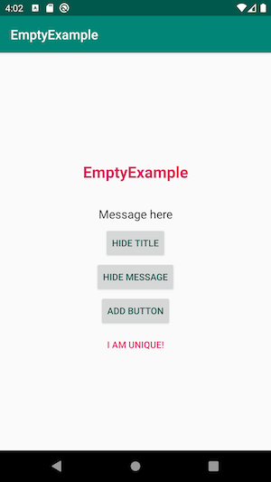

[](https://bintray.com/levibostian/Empty/com.levibostian.empty/_latestVersion)
[](https://github.com/levibostian/Empty-Android/blob/master/LICENSE)

# Empty 

Quick and easy View to use when you have no data to show. Also great for displaying errors!

*iOS developer? Check out [the iOS version of Empty!](https://github.com/levibostian/empty-ios)*

## What is Empty?

During those times where there is no data to show to your user, Empty to the rescue! Empty is a quick and easy way to display a message to your user and help with the next step by adding a button with 1 line of code.

Configured with default settings that will work for most use cases, but customizable enough to cover more.



## Why use Empty?

* Kotlin API
* Lightweight. Zero dependencies. 
* Setup with default values that should work for 95% of your use cases. Fully customizable for those other cases.
* Default look *just works* for dark mode. 

I recommend you check out 2 other libraries that work nicely with Empty: [PleaseHold](https://github.com/levibostian/PleaseHold-Android) and [Swapper](https://github.com/levibostian/Swapper-Android).

## Installation

To install Empty, simply add the following line to your `build.gradle` file:

```
implementation 'com.levibostian.empty:empty:version-goes-here'
```

Replace `version-here` with: [](https://bintray.com/levibostian/Empty/com.levibostian.empty/_latestVersion) which is the latest version at this time.

## Getting started 

* Add an instance of `EmptyView` to your layout:

```xml
<?xml version="1.0" encoding="utf-8"?>
<LinearLayout xmlns:android="http://schemas.android.com/apk/res/android"
    xmlns:app="http://schemas.android.com/apk/res-auto"
    xmlns:tools="http://schemas.android.com/tools"
    android:layout_width="match_parent"
    android:layout_height="match_parent">    

    <com.levibostian.empty.EmptyView        
        android:layout_width="match_parent"
        android:layout_height="wrap_content"        
        app:empty_title_text="@string/title"
        app:empty_message_text="Message here"/>    

</LinearLayout>
```

Notice the use of custom attributes `Empty` provides to you. 

| Attribute              | Notes                          | 
|------------------------|--------------------------------|
| app:empty_title_text   | Sets text for title TextView   | 
| app:empty_message_text | Sets text for message TextView | 

...if adding views programmatically is more your style, you can do that too...

```kotlin
val emptyView = EmptyView(ContextThemeWrapper(context, R.style.EmptyView_Custom), null, R.style.EmptyView_Custom).apply {
    title = "Title"
}

parent_view.addView(emptyView) 
```

*Note: The Kotlin code above sets a style to the `EmptyView` instance. If you want to use the default style set in your app's theme, you can simply use `EmptyView(context)`.*

* Optionally, set properties on your `EmptyView` instance to change what the View displays:

```kotlin
empty_view.title = getString(R.string.text)
empty_view.message = "Message here"
```

Set the text that the Title and Message `TextView`s show. If you set `null` as the title or message, the corresponding `TextView` will have a visibility set to `GONE` to hide it. 


You can add as many buttons to your `EmptyView` as you wish! This helps to provide a convenient action to your user to fix the problem. 
```kotlin
val REFRESH_BUTTON_ID = "Refresh_Action"

empty_view.listener = this 
empty_view.addButton(REFRESH_BUTTON_ID, getString(R.string.refresh))

override fun buttonPressed(id: String) {
    when (id) {
        REFRESH_BUTTON_ID -> {
            // perform refresh
        }
    }
}
```

*Note: When you call `addButton()`, if a button with the same ID has already been added, `EmptyView` will remove the old button and then add this new one. Therefore, make sure your ID is unique when you want to add more buttons.*

*Note: If you want to override the style of the button to add, provide the style with: `empty_view.addButton(REFRESH_BUTTON_ID, getString(R.string.refresh), R.style.EmptyView_Button_Custom)` referring to a style you created.* 

If you need to remove the button later, feel free to do so:
```kotlin
empty_view.removeButton(REFRESH_BUTTON_ID)
```

# Customize look of `EmptyView`

You have full control over the look of your `EmptyView`. All of the `TextView`s and `Button`s can be styled. Here is how. 

Empty relies heavily on Android Styles and Themes to customize the look of your `EmptyView` instance. If you are not familiar with how styles and themes work, I recommend you checkout [the official guide on styles and themes](https://developer.android.com/guide/topics/ui/look-and-feel/themes) before you jump into this doc.

The first step to customizing your `EmptyView` is to create a custom style. In your `styles.xml` file for your app, create a new custom style for the `EmptyView`:

```xml
<style name="EmptyView.Custom">
</style>
```

Now, when you want to use this custom style on an instance of `EmptyView` in your app, provide this style either in the XML layout:

```xml
<com.levibostian.empty.EmptyView        
    android:layout_width="match_parent"
    android:layout_height="wrap_content"        
    style="@style/EmptyView.Custom"/>   
```

Or, if you want to set your custom style as the default style for *all* instances of `EmptyView` in your app, apply this to your app's theme:

```xml
<style name="AppTheme" parent="Theme.AppCompat.Light.DarkActionBar">
    <item name="emptyview_style">@style/EmptyView.Custom</item>
</style>
```

Now, the custom style, `EmptyView.Custom`, at this time doesn't do anything. Why? Because the style is empty. You have done the base work in order to customize the look of `EmptyView` instances. Keep reading to learn how you can customize the Views. 

### Style title `TextView`

* Create a custom style for the `EmptyView.TitleTextView` and override anything you wish!

```xml
<style name="EmptyView.TitleTextView.Custom">
    <item name="android:textColor">@color/colorPrimary</item>
    <item name="android:padding">30dp</item>
</style>
```

* Then, apply this custom style to an `EmptyView` custom style you have created already:

```xml
<style name="EmptyView.Custom">
    <item name="emptyview_titleTextView">@style/EmptyView.TitleTextView.Custom</item>
</style>
```

### Style message `TextView`

Follow the instructions for *Style title `TextView`* except override `EmptyView.MessageTextView` instead of `EmptyView.TitleTextView` and use `<item name="emptyview_messageTextView">` instead of `<item name="emptyview_titleTextView">` as the `EmptyView` style custom attribute. 

### Style buttons

* Create a custom style for the `EmptyView.Button` and override anything you wish!

```xml
<style name="EmptyView.Button.Custom" parent="Widget.AppCompat.Button.Borderless">
    <item name="android:textColor">@color/colorAccent</item>
</style>
```

Notice above we are using `Widget.AppCompat.Button.Borderless` as the parent which means that our `EmptyView` button will be borderless. 

* Then, apply this custom style to an `EmptyView` custom style you have created already:

```xml
<style name="EmptyView.Custom">
    <item name="emptyview_button">@style/EmptyView.Button.Custom</item>
</style>
```

## Example

Empty comes with an example app you can use to play with the library. To run the example project, clone the repo and then open it up in Android Studio. 

## Development 

Empty is a pretty simple Android library project. At this time, all you need to do is open up the project in Android Studio and you are ready to go! 

## Author

* Levi Bostian - [GitHub](https://github.com/levibostian), [Twitter](https://twitter.com/levibostian), [Website/blog](http://levibostian.com)


## Contribute

Empty is open for pull requests. Check out the [list of issues](https://github.com/levibostian/Empty-android/issues) for tasks I am planning on working on. Check them out if you wish to contribute in that way.

**Want to add features to Empty?** Before you decide to take a bunch of time and add functionality to the library, please, [create an issue](https://github.com/levibostian/Empty-android/issues/new) stating what you wish to add. This might save you some time in case your purpose does not fit well in the use cases of Empty.

## License

Empty is available under the MIT license. See the LICENSE file for more info.
